<!--
  Rithvick Kumar — GitHub Profile README · v2 (editorial)
  Design language: dark #0D1117, flowing cyan→violet accent, self-hosted animated SVGs.
  Design assets generated by scripts/gen-design.mjs · stat cards by scripts/generate-stats.mjs
-->

<!-- ==================== HERO ==================== -->
<a href="https://github.com/Rithvickkr">
  
</a>

<!-- ==================== SOCIALS ==================== -->
<p align="center">
  <a href="https://linkedin.com/in/rithvick-kumar" target="_blank"></a>&nbsp;
  <a href="https://x.com/rithvickkr027" target="_blank"></a>&nbsp;
  <a href="mailto:rithvickkumar27@gmail.com"></a>&nbsp;
  <a href="https://github.com/Rithvickkr" target="_blank"></a>&nbsp;
  <a href="https://rithvick.online" target="_blank"></a>
  &nbsp;&nbsp;
  
</p>

<br />

<!-- ==================== 01 · ABOUT ==================== -->


```python
class Rithvick:
    role      = "AI/ML · Full-Stack · Backend Engineer"
    education = "B.Tech · NIT Kurukshetra ('26)"
    focus     = ["LLM & RAG pipelines", "agent tooling", "MCP servers", "production APIs"]
    flagship  = "ContextVolt · local-first AI context manager"
```

I build **production AI systems end to end** — retrieval pipelines, agents, and the backends that serve them: robust, measured, and running in prod. Currently deep in **RAG, MCP, and fine-tuning**, and open to collaboration on ambitious AI &amp; open-source work.

<br />

<!-- ==================== 02 · HIGHLIGHTS ==================== -->


<dl>
  <dt>&nbsp;🏆&nbsp;&nbsp;Google · Gemini CLI</dt>
  <dd>Reported 6 issues and authored fixes for <strong>2 priority-P1 bugs</strong> — an uncapped output buffer causing OOM crashes, and silent symlink skipping in the file-search &amp; grep tools.</dd>
  <br />
  <dt>&nbsp;🦷&nbsp;&nbsp;Dobbe.ai &nbsp;·&nbsp; <sub>AI / Full-Stack Intern</sub></dt>
  <dd>Built the AI-detection UI overlaying segmentation masks on dental X-rays, plus the Python / FastAPI services taking CV features from PoC → <strong>production</strong>.</dd>
  <br />
  <dt>&nbsp;💬&nbsp;&nbsp;Rocket.Chat</dt>
  <dd>Shipped an AI bot that detects FAQs in channel traffic and surfaces LLM-generated answers to moderators.</dd>
  <br />
  <dt>&nbsp;🎓&nbsp;&nbsp;NIT Kurukshetra &nbsp;·&nbsp; <sub>B.Tech, 2026</sub></dt>
</dl>

<br />

<!-- ==================== 03 · TECH STACK ==================== -->


<table align="center">
  <tr>
    <td align="center"><strong>AI / ML</strong></td>
    <td>
      
      &nbsp;
      
      
      
      
      
      
    </td>
  </tr>
  <tr>
    <td align="center"><strong>Languages</strong></td>
    <td></td>
  </tr>
  <tr>
    <td align="center"><strong>Backend</strong></td>
    <td>
      
      &nbsp;
      
      
      
    </td>
  </tr>
  <tr>
    <td align="center"><strong>Frontend</strong></td>
    <td></td>
  </tr>
  <tr>
    <td align="center"><strong>Data</strong></td>
    <td>
      
      &nbsp;
      
      
    </td>
  </tr>
  <tr>
    <td align="center"><strong>Tooling</strong></td>
    <td>
      
      &nbsp;
      
      
    </td>
  </tr>
</table>

<br />

<!-- ==================== 04 · GITHUB STATS ==================== -->


<p align="center">
  
  &nbsp;
  
</p>

<p align="center">
  
</p>

<br />

<!-- ==================== 05 · FEATURED PROJECTS ==================== -->


<table>
  <tr>
    <th align="left">Project</th>
    <th align="left">What it does</th>
    <th align="left">Stack</th>
    <th align="left">Links</th>
  </tr>
  <tr>
    <td valign="top"><strong>ContextVolt</strong><br /><sub><em>flagship</em></sub></td>
    <td valign="top">Privacy-first desktop app that captures, summarizes & indexes conversations from <strong>6 major LLMs</strong>. Hybrid retrieval (sqlite-vec + FTS5/BM25 + entity index) with listwise LLM reranking powers a RAG "Ask Your Vault" with inline citations. Ships a read-only <strong>MCP server</strong> over stdio/HTTP.</td>
    <td valign="top"><sub>Python · FastAPI · sqlite-vec · MCP · OAuth 2.0 · Ollama</sub></td>
    <td valign="top"><a href="https://github.com/Rithvickkr/ContextVolt">Code</a></td>
  </tr>
  <tr>
    <td valign="top"><strong>Empathetic AI Chatbot</strong></td>
    <td valign="top">Fine-tuned Gemini 2.5 on GoEmotions to detect user emotion and respond in Hinglish, steered by a novel <strong>Empathy Index (E-Score)</strong>.</td>
    <td valign="top"><sub>Gemini 2.5 · Vertex AI · Hugging Face</sub></td>
    <td valign="top"><a href="https://github.com/Rithvickkr">Code</a></td>
  </tr>
  <tr>
    <td valign="top"><strong>Founderly</strong></td>
    <td valign="top">AI startup-idea validator & pitch-deck generator — turns raw ideas into blueprints, decks and outreach campaigns.</td>
    <td valign="top"><sub>LangChain · Llama 3 · Next.js</sub></td>
    <td valign="top"><a href="https://founderly.tech">Live</a> · <a href="https://github.com/Rithvickkr/Foundrly">Code</a></td>
  </tr>
  <tr>
    <td valign="top"><strong>SkiziFy</strong></td>
    <td valign="top">P2P skill marketplace with real-time WebRTC video calling and scheduling.</td>
    <td valign="top"><sub>Next.js · WebRTC · Prisma · Postgres</sub></td>
    <td valign="top"><a href="https://skizify-liart.vercel.app">Live</a> · <a href="https://github.com/Rithvickkr/skizify">Code</a></td>
  </tr>
</table>

<br />

<!-- ==================== 06 · CONTRIBUTION GRAPH ==================== -->


<p align="center">
  <picture>
    <source media="(prefers-color-scheme: dark)" srcset="https://raw.githubusercontent.com/Rithvickkr/Rithvickkr/output/github-snake-dark.svg" />
    <source media="(prefers-color-scheme: light)" srcset="https://raw.githubusercontent.com/Rithvickkr/Rithvickkr/output/github-snake.svg" />
    
  </picture>
</p>

<br />

<!-- ==================== FOOTER ==================== -->

