<!--
  Rithvick Kumar — GitHub Profile · VERSION: Signature (vibrant/colorful)
  Swap live with:  scripts/use-version.ps1 v1   (or ./scripts/use-version.sh v1)
-->

<!-- ==================== HERO ==================== -->

<!-- ==================== SOCIALS ==================== -->

  &nbsp;
  &nbsp;
  &nbsp;
  &nbsp;
  

 

I'm an **AI/ML · Full-Stack · Backend** engineer who builds **production AI systems end to end**: LLM &amp; RAG pipelines, agent tooling, and MCP servers, plus the FastAPI / Node backends that serve them. My flagship, **ContextVolt**, is a local-first AI context manager built on a hybrid retrieval pipeline. I care about systems that actually ship (robust, measured, and running in prod), and I'm currently deep in **RAG, MCP, and fine-tuning**, open to collaboration on ambitious AI &amp; open-source work.

**Recent highlights**

- **Google · Gemini CLI** &nbsp;·&nbsp; reported 6 issues and authored fixes for **2 priority-P1 bugs** (OOM buffer overflow + symlink handling)
- **Dobbe.ai** &nbsp;·&nbsp; shipped an AI dental-X-ray detection UI + FastAPI backend to **production**
- **Rocket.Chat** &nbsp;·&nbsp; built an AI FAQ bot that surfaces LLM-generated answers to moderators

 

 

 

<table>
  <tr><th align="left">Project</th><th align="left">What it does</th><th align="left">Stack</th><th align="left">Links</th></tr>
  <tr>
    <td valign="top"><strong>ContextVolt</strong> <em>flagship</em></td>
    <td valign="top">Privacy-first desktop app that captures, summarizes & indexes conversations from <strong>6 major LLMs</strong>, with a hybrid RAG "Ask Your Vault" and a read-only <strong>MCP server</strong>.</td>
    <td valign="top">Python · FastAPI · sqlite-vec · MCP · Ollama</td>
    <td valign="top"><a href="https://github.com/Rithvickkr/ContextVolt">Code</a></td>
  </tr>
  <tr>
    <td valign="top"><strong>Empathetic AI Chatbot</strong></td>
    <td valign="top">Fine-tuned Gemini 2.5 on GoEmotions to detect emotion and respond in Hinglish, steered by a novel <strong>Empathy Index</strong>.</td>
    <td valign="top">Gemini 2.5 · Vertex AI · Hugging Face</td>
    <td valign="top"><a href="https://github.com/Rithvickkr">Code</a></td>
  </tr>
  <tr>
    <td valign="top"><strong>Founderly</strong></td>
    <td valign="top">AI startup-idea validator & pitch-deck generator.</td>
    <td valign="top">LangChain · Llama 3 · Next.js</td>
    <td valign="top"><a href="https://founderly.tech">Live</a> · <a href="https://github.com/Rithvickkr/Foundrly">Code</a></td>
  </tr>
  <tr>
    <td valign="top"><strong>SkiziFy</strong></td>
    <td valign="top">P2P skill marketplace with real-time WebRTC video calling.</td>
    <td valign="top">Next.js · WebRTC · Prisma · Postgres</td>
    <td valign="top"><a href="https://skizify-liart.vercel.app">Live</a> · <a href="https://github.com/Rithvickkr/skizify">Code</a></td>
  </tr>
</table>

 

