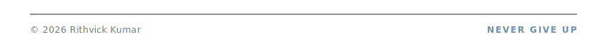

<!--
  Rithvick Kumar — GitHub Profile · VERSION: Azure (graphite mono + restrained steel-blue accent)
  Swap live with:  scripts/use-version.ps1 v5   (or ./scripts/use-version.sh v5)
  Design assets: scripts/gen-azure.mjs
-->

<!-- ==================== HERO ==================== -->

<!-- ==================== SOCIALS ==================== -->

  &nbsp;
  &nbsp;
  &nbsp;
  &nbsp;
  

 

<!-- ==================== ABOUT ==================== -->

I build **production AI systems end to end** — retrieval pipelines, agents, and the backends that serve them. I care about systems that actually ship: robust, measured, and running in prod. Currently deep in **RAG, MCP, and fine-tuning**.

<table>
  <tr><td valign="top"><b>FOCUS</b></td><td valign="top">LLM &amp; RAG pipelines · agent tooling · MCP servers · production APIs</td></tr>
  <tr><td valign="top"><b>FLAGSHIP</b></td><td valign="top">ContextVolt — local-first AI context manager</td></tr>
  <tr><td valign="top"><b>BASED</b></td><td valign="top">India · open to remote</td></tr>
</table>

 

<!-- ==================== SELECTED WORK ==================== -->

<table>
  <tr>
    <td valign="top" width="230"><b>Google · Gemini CLI</b></td>
    <td valign="top">Reported 6 issues and authored fixes for <b>2 priority-P1 bugs</b> — an uncapped output buffer causing OOM crashes, and silent symlink skipping in the file-search &amp; grep tools.</td>
  </tr>
  <tr>
    <td valign="top"><b>Dobbe.ai</b> AI / FULL-STACK INTERN</td>
    <td valign="top">Built the AI-detection UI overlaying segmentation masks on dental X-rays, plus the Python / FastAPI services taking CV features from PoC to <b>production</b>.</td>
  </tr>
  <tr>
    <td valign="top"><b>Rocket.Chat</b></td>
    <td valign="top">Shipped an AI bot that detects FAQs in channel traffic and surfaces LLM-generated answers to moderators.</td>
  </tr>
</table>

 

<!-- ==================== STACK ==================== -->

 

<!-- ==================== BY THE NUMBERS ==================== -->

 

<!-- ==================== PROJECTS ==================== -->

<table>
  <tr>
    <td valign="top" width="215"><b>ContextVolt</b> FLAGSHIP</td>
    <td valign="top">Privacy-first desktop app that captures, summarizes &amp; indexes conversations from 6 major LLMs — a hybrid RAG "Ask Your Vault" with a read-only MCP server. Python · FastAPI · sqlite-vec · MCP · Ollama</td>
    <td valign="top" width="90"><a href="https://github.com/Rithvickkr/ContextVolt">Code&nbsp;↗</a></td>
  </tr>
  <tr>
    <td valign="top"><b>Empathetic AI Chatbot</b></td>
    <td valign="top">Fine-tuned Gemini 2.5 on GoEmotions to detect emotion and respond in Hinglish, steered by a novel Empathy Index. Gemini 2.5 · Vertex AI · Hugging Face</td>
    <td valign="top"><a href="https://github.com/Rithvickkr">Code&nbsp;↗</a></td>
  </tr>
  <tr>
    <td valign="top"><b>Founderly</b></td>
    <td valign="top">AI startup-idea validator &amp; pitch-deck generator. LangChain · Llama 3 · Next.js</td>
    <td valign="top"><a href="https://founderly.tech">Live&nbsp;↗</a> · <a href="https://github.com/Rithvickkr/Foundrly">Code&nbsp;↗</a></td>
  </tr>
</table>

 

<!-- ==================== FOOTER ==================== -->

